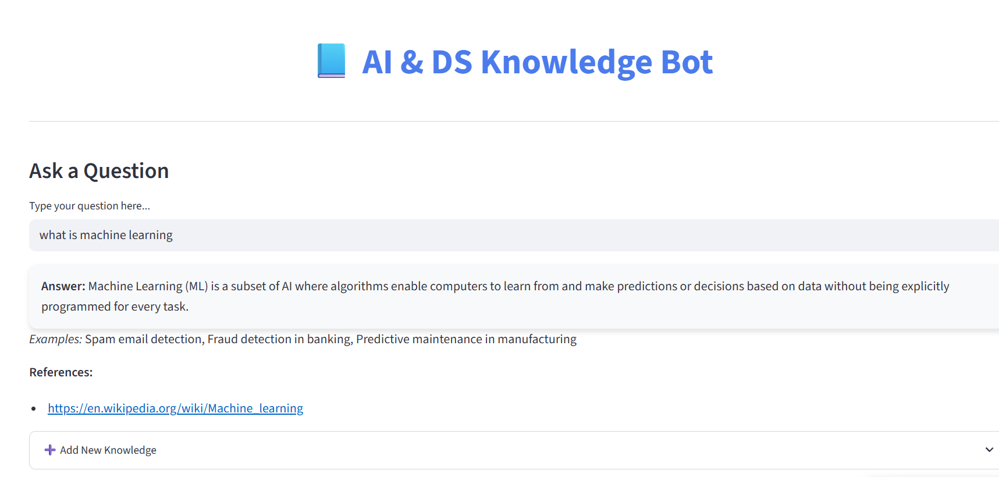
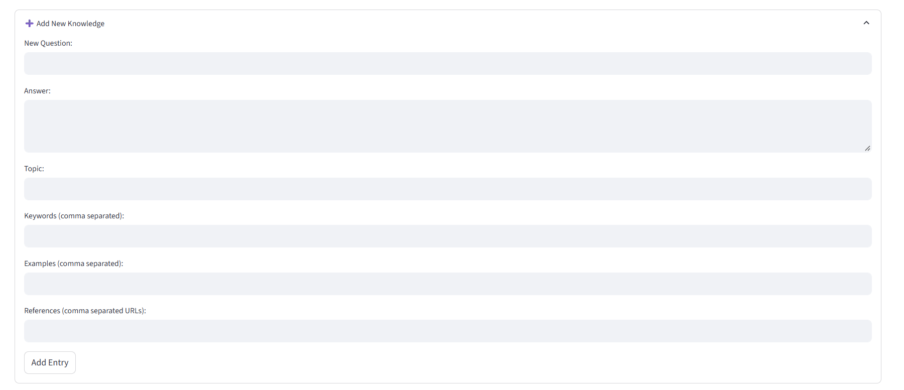
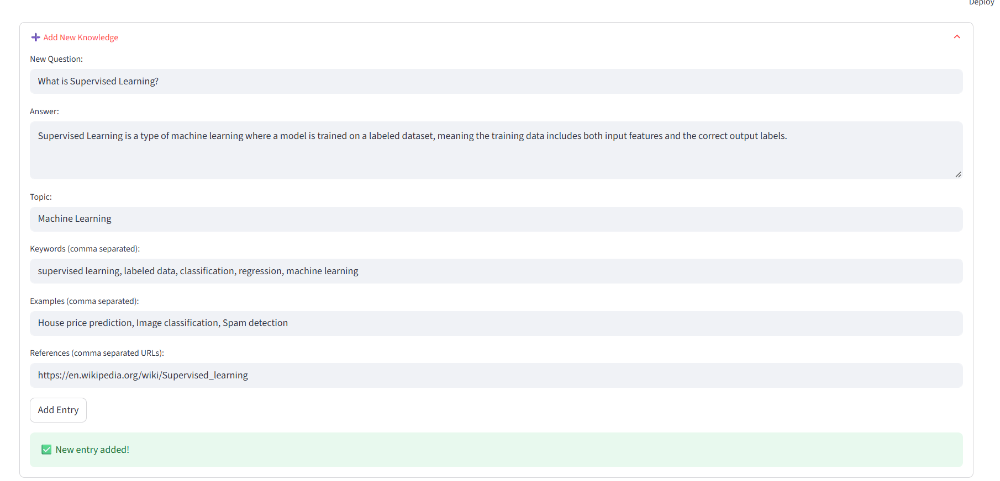

# AI & DS Knowledge Bot

An interactive AI and Data Science learning assistant built with **Python, Streamlit, and Sentence Transformers**. The application matches user questions with relevant knowledge using sentence embeddings and cosine similarity, adds a small keyword-based boost, shows references/examples, and supports adding new knowledge to a JSON-backed knowledge base.

> **Repository type:** Educational AI/NLP application  
> **Primary language:** Python

## ✨ Features

- **Semantic question matching** using Sentence Transformer embeddings
- **Cosine-similarity retrieval** against the knowledge base
- **Keyword score boost** to improve relevance when known keywords appear
- **Similarity threshold** before returning a direct answer
- **Related-question suggestions** when a direct match is not confident enough
- **Topic and reference display** for learning support
- **Add New Knowledge** workflow that persists entries to `knowledge_base.json`
- **Streamlit interface** for interactive use

## 🧠 How It Works

```text
User question
     ↓
Sentence Transformer embedding
     ↓
Cosine similarity against knowledge-base questions
     ↓
Keyword boost
     ↓
Best-match score
     ├── Above threshold → answer + examples + references
     └── Below threshold → related topics + similar questions + references
```

The current implementation uses the model:

`paraphrase-multilingual-MiniLM-L12-v2`

and a default direct-answer threshold of **0.65**.

## 🛠️ Tech Stack

- Python
- Streamlit
- Sentence Transformers
- PyTorch (installed as a dependency of Sentence Transformers)
- JSON
- Cosine similarity

## 📁 Project Structure

```text
ai-ds-knowledge-bot/
├── app.py
├── knowledge_base.json
├── requirements.txt
├── screenshots/
│   ├── 01-home-semantic-answer.png
│   ├── 02-add-knowledge-form.png
│   └── 03-add-knowledge-success.png
├── .gitignore
└── README.md
```

## 🚀 Run Locally

### 1. Clone the repository

```bash
git clone <YOUR-REPOSITORY-URL>
cd ai-ds-knowledge-bot
```

### 2. Create and activate a virtual environment

Windows PowerShell:

```powershell
python -m venv .venv
.\.venv\Scripts\Activate.ps1
```

macOS/Linux:

```bash
python3 -m venv .venv
source .venv/bin/activate
```

### 3. Install dependencies

```bash
pip install -r requirements.txt
```

The first run downloads the Sentence Transformer model, so an internet connection is required for initial model setup.

### 4. Start the application

```bash
streamlit run app.py
```

Streamlit will provide the local URL in the terminal.

## 📸 Screenshots

### Question answering



### Add new knowledge



### Knowledge successfully saved



## 🔍 Example Workflow

A user can ask a question such as:

> `What is Machine Learning?`

The application generates an embedding for the query, compares it with the stored questions, and returns the highest-scoring relevant entry when the score passes the configured threshold.

When the match is not confident enough, the application instead shows related topics, similar questions, and references that can guide the user toward a useful answer.

## 📦 Knowledge Base

`knowledge_base.json` stores structured entries containing fields such as:

- question
- answer
- topic
- keywords
- examples
- references
- similar_questions

The **Add New Knowledge** form appends new entries to this file for local use.

## 🎯 Project Highlights

This project demonstrates practical application of:

- Natural language processing concepts
- Text embeddings
- Semantic similarity
- Information retrieval
- Lightweight relevance ranking
- Interactive Python application development
- Structured JSON knowledge management

## 🔮 Possible Future Improvements

- Conversation memory with a structured chat interface
- Persistent vector index for larger knowledge bases
- Better duplicate-question detection
- Topic filtering and search
- Authentication for knowledge editing
- External database storage instead of a local JSON file

## 📄 License

No open-source license is included at present. All rights reserved unless a separate license is added by the repository owner.
